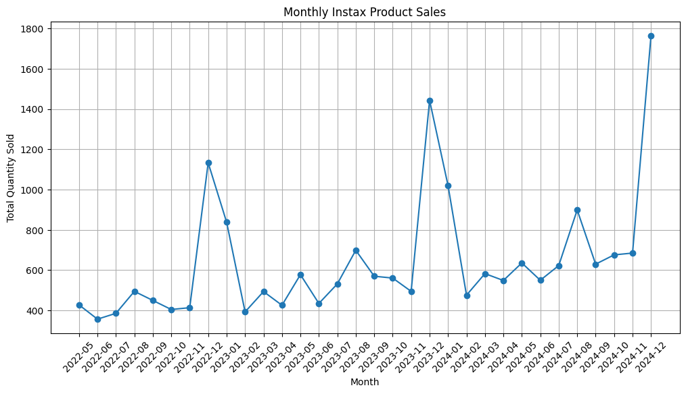
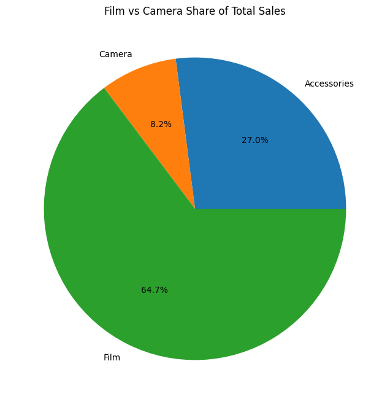
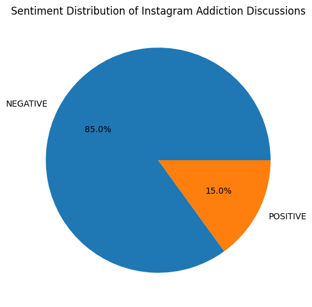
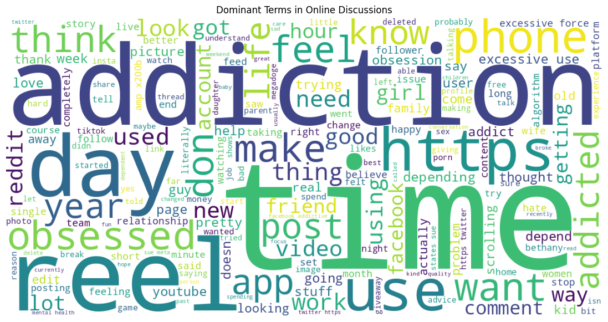
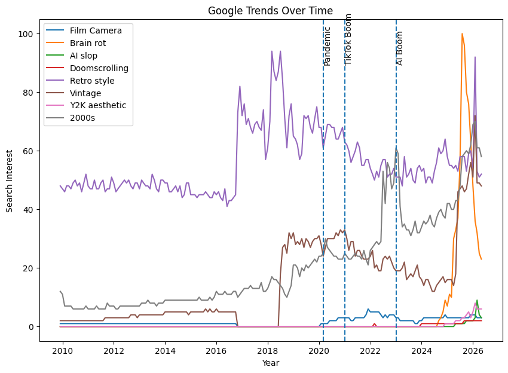
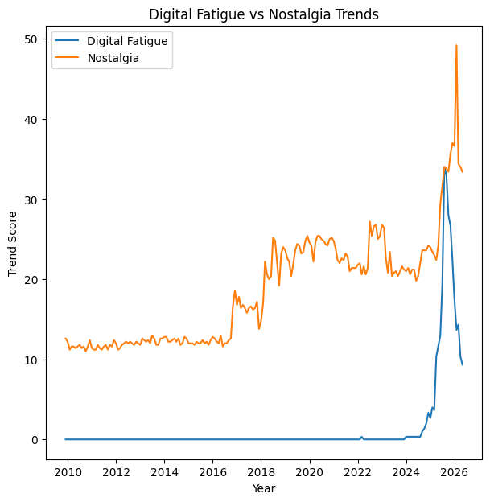
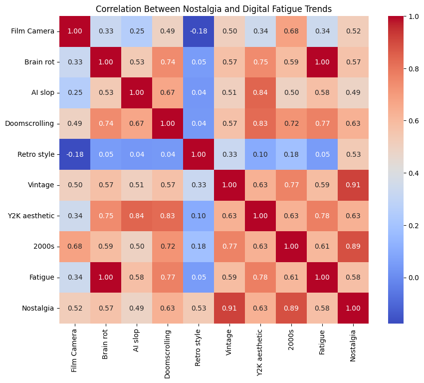
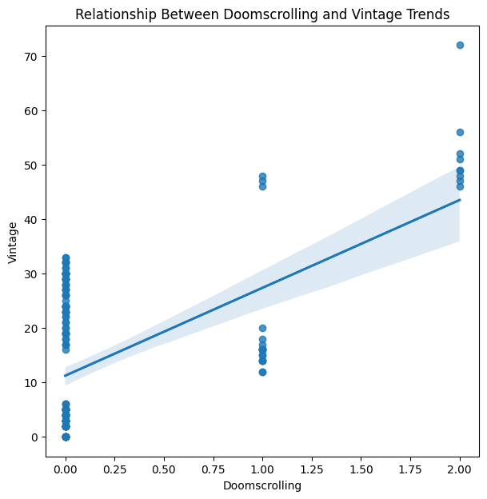

[README.md](https://github.com/user-attachments/files/27767517/README.md)

# 🎥🎞️ Nostalgic Aesthetics as Responses to Modern Hyper-Online Life
### An Exploratory Data Analysis Project

---

## The Hypothesis

> **As modern digital environments become more algorithmic, fast-paced, and overstimulating, users increasingly seek nostalgic and analog experiences that feel more authentic, emotionally comforting, and human.**

We are living through a paradox. The more seamlessly the internet integrates into daily life, the more people appear to be turning *away* from it.
Instant photography. Film cameras. Vintage clothing. Y2K. 2000s nostalgia. These aren't random revivals. This project asks: **what if they are symptoms?**

---

##  Project Structure

```
 nostalgia/
│
├──  visuals /
│   ├── monthly_quantity_sold.png
│   ├── monthly_revenue_trend.png
│   ├── yearly_quantity_sold.png
│   ├── camera_vs_film_trend.png
│   ├── top_selling_products.png
│   ├── revenue_by_sales_channel.png
│   ├── film_vs_camera_share.png
│   ├── sentiment_distribution.png
│   ├── theme_distribution.png
│   ├── wordcloud_discussions.png
│   ├── google_trends_over_time.png
│   ├── fatigue_vs_nostalgia.png
│   ├── lag_correlation.png
│   ├── correlation_heatmap.png
│   ├── doomscrolling_vs_vintage.png
│   └── yearly_cultural_trend_change.png
│
├──  src /
│   ├── google_trends_analysis.py # Google Trends: nostalgia vs. digital fatigue
│   ├── insta_analysis.py # Instagram sentiment & digital fatigue NLP
│   ├── sales_analysis.py  # Instax / analog camera sales trends
│
├──  data /
│   ├── insta_sentiment_data.csv
│   ├── instax_sales_transaction_data.csv
│   ├── nostalgia.csv

```

---

## The Story in Three Acts

### Act I — The Market Speaks: Instax Sales Analysis

*In a world of infinite digital photos, why are people returning to physical photography?*

The first dataset examines **Fujifilm Instax sales transactions** — a product line built entirely on the charm of imperfection: overexposed edges, slightly washed-out colours If the nostalgia trend were purely aesthetic — a filter on Instagram, a mood board on Pinterest — you wouldn't expect it to move physical units. But the traces of this shift appear in purchasing patterns .

**What the data reveals:**

- **Monthly Quantity Trends** examine whether Instax demand is increasing steadily, stabilizing, or responding to broader cultural shifts. Growth in these trends reflects more than consumer spending, it indicates a growing preference for tangible experiences. 



- **Camera vs. Film Sales Ratio** is the most telling KPI of all. A high film-to-camera ratio means people who already *own* the camera keep *using* it. They aren't just buying a novelty object and letting it collect dust — they're committing to analog photography.



A high film-to-camera ratio of 7.86 suggests people continued consumer engagement with analog photography.

> **Hypothesis Link:** Rising Instax sales, especially repeat film purchases, suggest consumers are actively investing in analog experiences — not just fantasising about them.

---

### Act II — The Algorithm Knows You're Tired: Instagram Sentiment Analysis

*The place where people go to escape boredom has itself become a source of exhaustion.*

The second dataset turns inward — to the words people use on Reddit when they talk about Instagram. Using **NLP, TF-IDF analysis, and theme-based classification**, this analysis maps the emotional texture of online discourse around social media addiction and digital fatigue.

**What the data reveals:**

- **Sentiment Distribution** answers a blunt question: when people talk about Instagram and addiction in the same breath, are they mostly positive, negative, or neutral? A skew toward negativity here anchors the emotional backdrop against which nostalgia must be understood.



- **Top Words by Sentiment** and the **Word Cloud** strip away structure and let the raw vocabulary speak. When "dopamine," "algorithm," "anxiety," and "attention" dominate the language of negative posts, the picture becomes clear: people aren't just bored. They feel *manipulated*.



**Top Words in Negative Posts**
 
| Rank | Word | Frequency |
|------|------|-----------|
| 1 | time | 142 |
| 2 | addiction | 128 |
| 3 | reels | 111 |
| 4 | use | 104 |
| 5 | phone | 74 |
| 6 | obsessed | 66 |
| 7 | excessive | 62 |
 
The vocabulary of negative posts is clinically precise. *Addiction* and *obsessed* point to compulsive behaviour; *reels* pins the frustration to Instagram's short-form algorithm. *Excessive* and *time* together suggest the dominant complaint is not just what people are consuming, but how much of their lives it is taking. This is the language of people who feel they have lost control

> **Hypothesis Link:** The emotional exhaustion surfacing in online discourse creates the psychological conditions for nostalgia — a retreat toward simpler, slower, more controllable experiences.

---

### Act III — The Search Bar Reveals : Google Trends Analysis

*Purchases can be influenced. Search behavior is often instinctive.*

The third and most macro-level dataset uses **Google Trends data** to plot search interest over time across two competing cultural forces: **Digital Fatigue** (Brain Rot, AI Slop, Doomscrolling) and **Nostalgia** (Film Camera, Vintage, Retro Style, Y2K Aesthetic, 2000s).

**What the data reveals:**

- **Google Trends Over Time** plots all search terms against three cultural fault lines:
  - **March 2020** — Pandemic lockdowns. The world went online, all at once.
  - **January 2021** — The TikTok Boom. Short-form video rewired attention spans globally.
  - **January 2023** — The AI Boom. *content creation* becomes automated.
 


  Each of these events represents an escalation in digital saturation. the nostalgia lines act in response.

- **Digital Fatigue vs. Nostalgia Composite Scores** condense the complexity into two clean trend lines. The key question: do they move *together*? Does one *lead* the other?



- **Correlation Heatmap** reveals the full relationship matrix between all tracked terms. Does "Brain Rot" correlate with "Film Camera"? Does "Doomscrolling" move with "Vintage"?



- **Doomscrolling vs. Vintage Regression** isolates this specific relationship — two terms that could not sound more different, plotted against each other to see if they share a hidden rhythm.



---

### 📈 Google Trends — Key Findings

**Fastest Growing Term: Vintage (+46 points)**

Of all the terms tracked, *Vintage* recorded the highest total growth across the dataset — a net increase of 46 index points from start to finish. This is not a spike. It is a sustained, structural climb that outlasted every short-lived aesthetic trend around it.

**Average Yearly Increase by Term**

| Search Term | Avg. Yearly Increase |
|---|---|
| Vintage | +3.05 |
| 2000s | +3.05 |
| Brain rot | +1.93 |
| Digital Nostalgia | +1.71 |
| Nostalgia (composite) | +1.47 |
| Analog Nostalgia | +1.31 |
| Fatigue / Digital Fatigue | +0.76 |
| Retro style | +0.73 |
| Y2K aesthetic | +0.36 |
| AI slop | +0.25 |
| Film Camera | +0.14 |
| Doomscrolling | +0.12 |

The table tells a striking story: **nostalgia-adjacent terms are growing at 2–4× the rate of digital fatigue terms.** Even *Brain Rot* — 2025's breakout slang for algorithmic overstimulation — grows at a slower average rate than *Vintage* or *2000s*. The emotional response appears to be outpacing the problem it is responding to.

**Peak Search Years**

| Search Term | Peak Year | Peak Score |
|---|---|---|
| Vintage | 2026 | 72 |
| 2000s | 2026 | 70 |
| Brain rot | 2025 | 100 |
| Doomscrolling | 2025 | 2 |
| Retro style | 2018 | 94 |
| Y2K aesthetic | 2026 | 8 |
| Film Camera | 2021 | 6 |
| AI slop | 2026 | 9 |

 the nostalgia terms — *Vintage*, *2000s*, *Analog Nostalgia*, *Digital Nostalgia*, *Y2K* — is peaking in 2026. *Brain Rot* peaked at a score of 100 in 2025 — the maximum possible on Google Trends — confirming that digital fatigue discourse hit a cultural ceiling  one year before nostalgia terms, suggesting a lag correlation between the terms. 

> **Hypothesis Link:** If nostalgia search interest demonstrably rises in the months following spikes in digital fatigue, the hypothesis moves from compelling to evidenced.

---

##  Key KPIs at a Glance

| KPI | Source | What It Tests |
|-----|--------|---------------|
| Film-to-Camera Sales Ratio | `sales_analysis.py` | Depth of analog commitment, not just novelty |
| Yearly Instax Sales Growth | `sales_analysis.py` | Whether analog interest is sustained over time |
| Sentiment Score Distribution | `insta_analysis.py` | Emotional tone of digital fatigue discourse |
| Digital Detox Theme Frequency | `insta_analysis.py` | Scale of desire to disconnect |
| Lag Correlation (Fatigue → Nostalgia) | `google_trends_analysis.py` | Causal direction of the fatigue-nostalgia link |
| Fastest Growing Search Term | `google_trends_analysis.py` | Which side of the tension is accelerating |
| Doomscrolling ↔ Vintage Correlation | `google_trends_analysis.py` | Direct link between fatigue behaviour and retro search |

---

##  Tech Stack

```python
pandas          # Data manipulation & time-series analysis
matplotlib      # Trend visualisation & chart generation
seaborn         # Correlation heatmaps & regression plots
scikit-learn    # TF-IDF vectorisation for NLP
wordcloud       # Visual keyword analysis
collections     # Keyword frequency counting
numpy           # Composite score calculation
re              # Text cleaning & tokenisation
```

---

##  Datasets Used

| Dataset | Description |
|---------|-------------|
| `instax_sales_transaction_data.csv` | Fujifilm Instax product sales records with date, product, category, channel, quantity, and revenue |
| `insta_sentiment_data.csv` | Reddit posts discussing Instagram addiction, labelled with sentiment scores |
| `nostalgia.csv` | Google Trends export tracking search interest in nostalgia and digital fatigue terms over time |

---

##  Conclusions & Interpretation

This project does not claim that everyone buying a disposable camera is having an existential crisis about TikTok. But the convergence of three independent datasets — consumer spending, online emotional discourse, and mass search behaviour — points toward something more than coincidence.

**The pattern that emerges:**

**1. Digital fatigue is real, measurable, and linguistically specific :** It shows up not just as a vague feeling but as precise vocabulary — addiction, reels, obsessed, excessive — repeated consistently across thousands of posts.

**3. The analog and retro response is sustained, not seasonal :** A film-to-camera ratio of 7.86 means repeat purchases, not impulse buys. Vintage growing at +3.05 points per year, and still peaking in 2026, means this is not a trend that peaked and faded. It is still climbing.

**4. The timing follows a logic :** Brain Rot hits the ceiling of 100 in 2025. Vintage, 2000s, and the nostalgia composite peak in 2026. The cultural accelerators — pandemic, TikTok, AI — each precede measurable upticks in retro-oriented behaviour. this sequence is consistent.

---

##  How to Run

```bash
# Clone the repository
git clone https://github.com/yourusername/digital-nostalgia-eda.git
cd digital-nostalgia-eda

# Install dependencies
pip install pandas matplotlib seaborn scikit-learn wordcloud numpy

# Place datasets in the project root, then run each script
python sales_analysis.py
python insta_analysis.py
python google_trends_analysis.py
```

Charts will be saved as `.png` files in the project root.

---

## Author

**Meher Vaswani** |
Data Scientist

---
